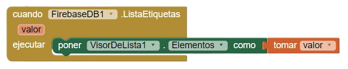
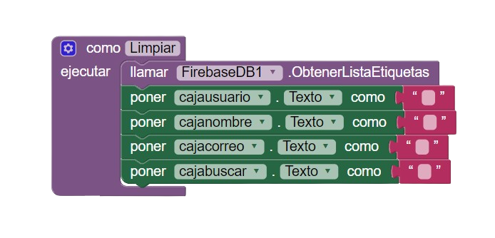
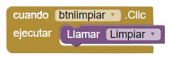
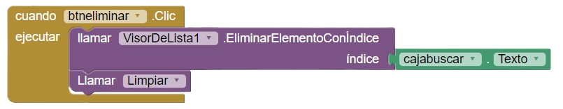
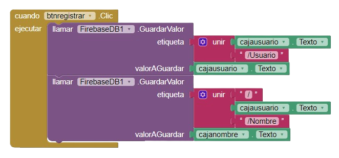
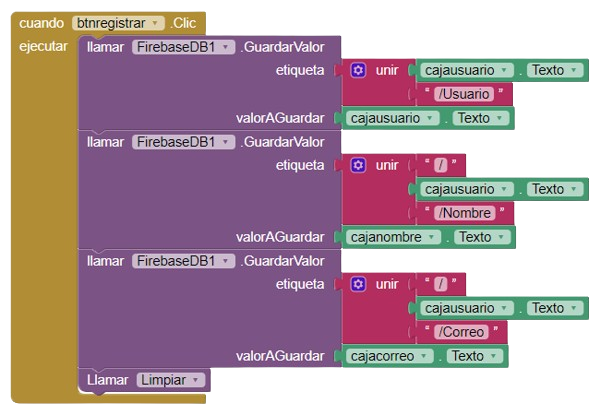
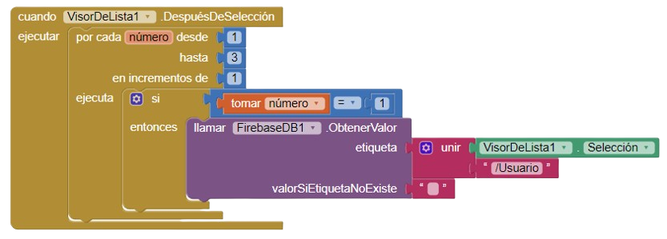
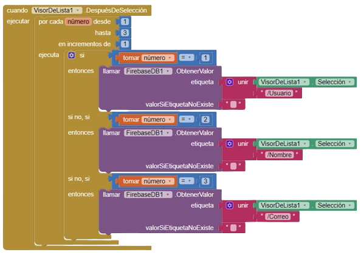
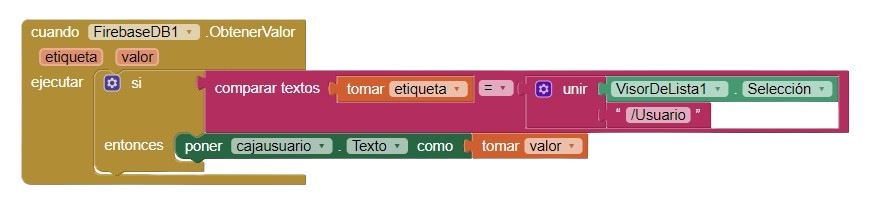
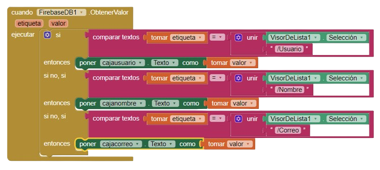

# CRUD Base de Datos

En este proyecto aprenderemos a crear una aplicación en __MIT APP INVENTOR__ que te permita **Registrar**, **Modificar**, **Buscar**, **Listar** y **Eliminar** los datos almacenados en una base de datos almacenada en la nube. :cloud: 

## Proceso de Diseño
El diseño de la aplicación puede ser modificado a tu gusto, a continuación se encuentran las partes cruciales de la _UI_ que se deben implementar para el funcionamiento de la aplicación.
#### Elementos principales:
- **Cajas de texto**:
	- Usuario
	- Nombre
	- Correo
	- Buscador
- **Botones**:
	- Crear/Actualizar
	- Buscar
	- Limpiar
	- Eliminar
- **Visor en Lista** (único)
> [!TIP]
> Es posible el uso de etiquetas a conveniencia para facilitar la coomprensión y el uso de la _UI_

## Creación de la Base de Datos (FirebaseDB)
Una vez implementado el componente FirebaseDB a nuestra aplicación, ingresaremos al __sitio web de Firebase__ y crearemos un nuevo proyecto, una vez completada su creación ingresaremos al apartado de "Realtime Database" y crearemos una nueva base de datos. Una vez creada, iremos a la pestaña de ___Reglas___, donde modificaremos todos los "false" por "true", y para guardar los cambios clickeamos el botón ___"Publicar".___
Finalmente regresamos a la pestaña de ___Datos___, donde copiaremos el enlace de conexión, nos trasladamos a la aplicación y lo pegamos en el componente __FirebaseDB__ en la opción llamada __URLFirebase__ .

## Procesos lógicos

### Buscar
Comenzaremos por mostrar la lista de usuarios registrados en la base de datos, para ello solamente mandamos llamar la lista de etiquetas, y tomamos el valor de cada uno de sus elementos para mostrarlo en el ___Visor de Lista___.

Y, ahora sí, para buscar debemos de seleccionar el dato que estamos buscando en el ___Visor de Lista___, donde usaremos la opción de selección, y la caja buscar.

### Limpiar
Continuamos por crear el procedimiento ___Limpiar___, el cuál se encargará de actualizar la tabla de usuarios, y a la vez limpiará las Cajas de Texto, una vez creado invocaremos la lista de usuarios de la base de datos con la función de ___ObtenerListaEtiquetas___, y finalmente mandamos llamar el texto de cada Caja de Texto para asignarle un cuadro de texto vacío.

Es importante no olvidar asignarle la funcionalidad al ___Botón Limpiar___, para cuando le des click ejecute el procedimiento Limpiar... 

### Eliminar

Seguimos con el botón eliminar. Este botón primero ubicará en la base de datos el nombre del usuario que está
escrito en la caja de texto ___usuarios___, luego lo eliminará. Para eliminarlo se usará el bloque ___Eliminar Elemento con Índice___ del nombre de usuario escrito en la ___Caja Buscar___.
Luego de eliminar al usuario, ejecutamos el procedimiento limpiar.

### Registrar

Para registrar a los nuevos usuarios hacemos uso del bloque ___Guardar Valor___. Debemos de armar el campo donde se almacenará los datos del usuario a registrar. Primero se crea la etiqueta principal, esta etiqueta se encargará de almacenar otras etiquetas y en estas otras etiquetas se almacenará los datos. Cada usuario tendrá su propia etiqueta principal y sus sub-etiquetas para que sea más fácil y ordenado ubicar sus datos.
Para ello, uniremos el texto de la ___Caja de Texto___ del ___usuario___, con una sub-etiqueta llamada ___/Usuario___... 
La diagonal seguida de un texto es la que te permitirá crear una segunda etiqueta, en este caso será la etiqueta usuario y lo que almacenará en esa etiqueta será lo que escribimos en la caja usuario, así se deberia de ir viendo.

Faltaría registrar el nombre y el correo, para ello duplicamos el bloque de ___Guardar Valor___ ya creado...
Usamos la diagonal y el nombre de la etiqueta principal (la etiqueta principal siempre será el usuario), debemos de crear la sub etiqueta para el Nombre: ___/Nombre___, y la ultima etiqueta será para el nombre y guardará lo que hay en la caja nombre. 

Finalmente haremos lo mismo, duplicaremos los bloques de ___Guardar Valor___, pero ahora para registrar el correo...
Luego de Registrar o Modificar a un usuario, debemos de ejecutar la función ___Limpiar___ para actualizar los datos de la lista.

Lo que vamos a hacer a continuación es enviar los datos del usuario seleccionado a las cajas de texto, esto será útil para facilitar la modificación de cada usuario. Para ello necesitamos crear un bucle, este bucle tendrá que recorrer por cada sub-etiqueta, cada etiqueta principal tiene ___usuario, nombre y correo___, entonces deberá de recorrer tres veces. Necesitamos agregar una condicion... Sí en la primera vuelta recoge la sub-etiqueta usuario, entonces el número que está recorriendo el bucle es el 1, por lo tanto obtendrá la sub-etiqueta usuario.

De la misma manera lo haremos para los otros datos, solo debemos de modificar la sub-etiqueta a recoger.
En la segunda vuelta recogerá la sub-etiqueta nombre, y en la tercera vuelta recogerá la sub-etiqueta correo.

Finalmente faltaría tomar el valor de cada etiqueta y mostrarlo en las cajas de texto... Para ello,  usamos el bloque ___Obtener Valor___, primero necesitamos condicionar, la condición será que si la etiqueta que se ha recogido anteriormente en el bucle es la del usuario, entonces tomará el valor de esa etiqueta y lo mostrará en la caja de texto usuario.

Ahora solamente duplicamos el bloque, y modificamos para el Nombre y el Correo.

## Referencias
- https://youtu.be/ULgrjE3asZA?si=d6FZYVLBkVp0KOIT
